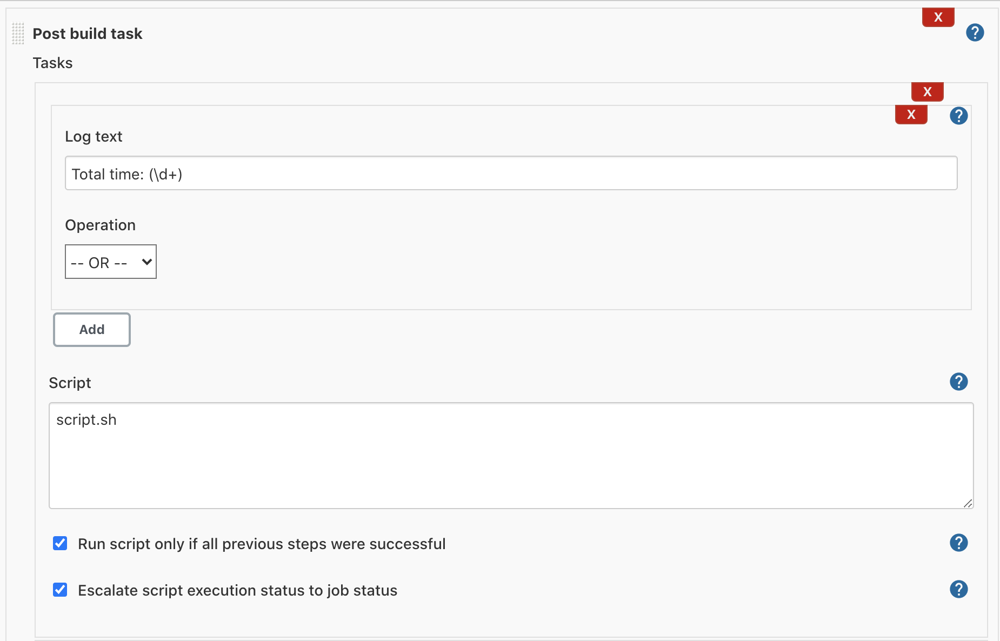

# Post build task

This plugin allows the user to execute a shell/batch task depending on
the build log output. Java regular expression are allowed.

This feature allows user to associate shell or a batch scripts that
perform some tasks on Hudson depending on the build log output. If the
log text has a match some where in the build log file, the script will
execute and the post build log will append to the project build log.
Java regular expression are allowed.

## Usage

When you install this plugin, your project configuration page gets
additional "Post build task" option as illustrated below:

The Post build task consists of log texts and a script.For the multiple
searches, log texts could be joined by an 'And' or an 'Or'. For example,
if text "BUILD FAILED" OR "IOException" is found, then it runs the
command. For multiple search click on the add button will create one
option box (And & Or) and a new log text box.

If the log text has a match it is considered as true otherwise false. Do
a bitwise operation for the total match results and if the bitwise
result is true, the script will execute otherwise skip

#### Example:1

'BUILD FAILED' OR 'IOException' AND 'Building remotely'  
'BUILD FAILED' matches so --\> 'true'  
'IOException' does not match so --\> 'false'  
'Building remotely' matches so --\> 'true'  
((true OR false) AND true) --\> 'true' (does execute)

#### Example:2

'BUILD FAILED' AND 'IOException' AND 'Building remotely'  
'BUILD FAILED' matches so --\> 'true'  
'IOException' does not match so --\> 'false'  
'Building remotely' matches so --\> 'true'  
((true AND false) AND true) --\> 'false' (does not execute)

Java Regex are allowed for matching log text. If the text is "Total
time: (\\d+)" and the script is "script.sh", then if the log contains a
line "Total time: 10", the "script.sh 10" will be called.

Specify the shell script to be executed when the execution of the task
is selected. This is where the actual work happens. When the script
executes, the current directory will be the workspace directory, just
like the shell script builder. So depending on your SCM, you might have
to cd into a directory. Try "pwd" and "ls" to find out whether you need
that or not.
